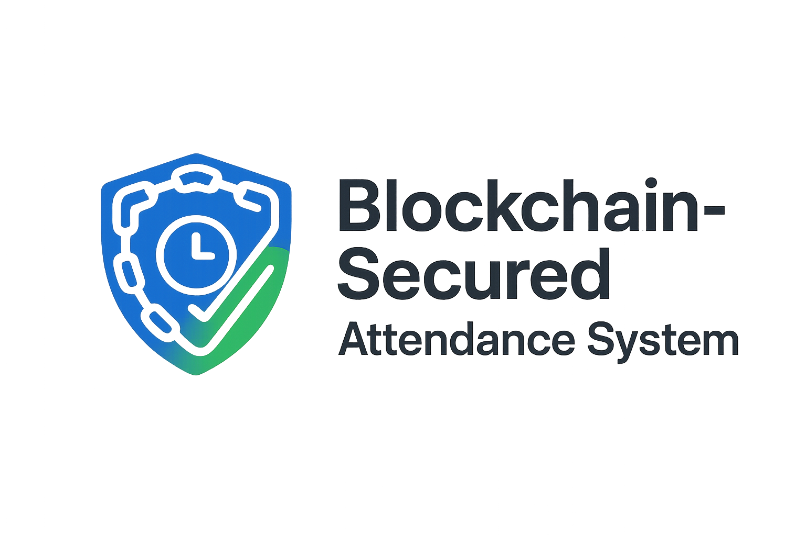

<!-- Banner -->
<p align="center">
  
</p>

<h1 align="center">🛡 Blockchain-Secured Log-Based Attendance System</h1>
<p align="center">
  A secure, IP-fenced, blockchain-verified attendance management system that does not use SQL — all records are stored in `.log` files and chained with blockchain-style hashing.
</p>

<p align="center">
  
  
  
</p>

---

## 🚀 Features

<table>
<tr>
<td width="50%">

### 👤 Client/User
- Check-in / Check-out attendance  
  
  
- Create support tickets  
  
- View announcements  
  

</td>
<td width="50%">

### 🛠 Admin
- Enable/Disable check-in and check-out modes  
  
- View all logs (valid & failed attempts)  
  
  
- Create, edit, and delete courses  
  
- Set active courses for attendance  
  
- Make manual attendance entries  
  
- Unlink fingerprints from users  
  
- View Support Tickets  
  
- Post announcements  
  
- Blockchain verification of logs  
  

</td>
</tr>
</table>

---

## 🔒 Security Highlights
- **Input sanitization** (`filter_var` & trimming on all POST data)  
- **IP logging** and **device fingerprinting** to prevent spoofing  
- **Duplicate prevention** (same matric or IP cannot perform the same action twice per day)  
- **Checkout restriction** — cannot checkout without a prior check-in  
- **Invalid attempts log** for all failed check-ins/outs  
- **Blockchain log chaining** to make tampering detectable  
- **Optional Polygon integration** for decentralized hash storage  

---

## ⚙️ Running Locally

### 1️ Using XAMPP or WAMP
 #  Installation
 1.  Clone the repository
 ```bash
  git clone https://github.com/MAVIS-creator/Attendance_.git
```
2. Install [XAMPP](https://www.apachefriends.org/) or [WAMP](https://www.wampserver.com/).
3. Place the project folder inside:
   - **XAMPP:** `htdocs`
   - **WAMP:** `www`
4. Start Apache from the control panel.
5. Access in your browser: 
```bash 
http://localhost/Attendance_
```

### 2️⃣ Using PHP Built-in Server
```bash
php -S localhost:8000
```
Visit:

```bash
http://localhost:8000
```
📁 Log Files
```bash

admin/logs/YYYY-MM-DD.log → valid attendance logs
admin/logs/YYYY-MM-DD_failed_attempts.log → failed login or action attempts
secure_logs/attendance_chain.json → blockchain-secured log history
```

📝 License
- This project is licensed under the MIT LICENSE – see the <a href="https://github.com/MAVIS-creator/Attendance_/blob/main/LICENSE">LICENSE</a> file for details.

👤 Author
- Mavis – Gamer, Web Developer, Security Enthusiast
- 📧 Email: mavisenquires@gmail.com
- 🐙 GitHub: [MAVIS-creator](https://github.com/MAVIS-creator)
💻  Co Author
[SamexHighshow](https://github.com/SamexHighshow)
