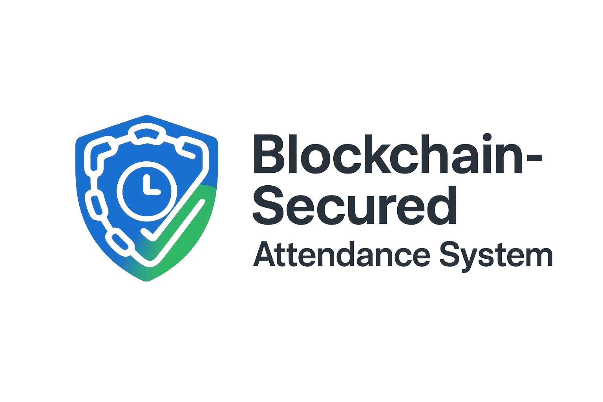

<p align="center">
  
</p>

<h1 align="center">🛡️ Blockchain-Secured Attendance System</h1>

<p align="center">
  <strong>A tamper-proof, AI-powered, SQL-free attendance management platform — secured by blockchain-style log chaining, device fingerprinting, geofencing, and real-time revocation.</strong>
</p>

<p align="center">
  
  
  
  
  
  
</p>

<p align="center">
  <a href="https://attendancev2app123.azurewebsites.net"><strong>🌐 Live Demo</strong></a> ·
  <a href="QUICKSTART.md"><strong>⚡ Quickstart</strong></a> ·
  <a href="FEATURES_IMPLEMENTED.md"><strong>📋 Full Feature Inventory</strong></a> ·
  <a href="CONTRIBUTING.md"><strong>🤝 Contribute</strong></a>
</p>

---

## 📖 What Is This?

A **production-grade attendance system** that replaces traditional SQL databases with an append-only, blockchain-chained log architecture. Every attendance record is cryptographically linked to the one before it using **SHA-256 hashing** — making silent data tampering detectable at a glance.

On top of that foundation, the system layers:
- 🤖 **AI-powered** ticket automation, announcements, admin chat, and rulebook enforcement
- 🔐 **Enterprise security** — geofencing, IP whitelisting, device fingerprinting, CSRF, AES-256 encryption
- 📧 **Automated email reporting** — CSV/PDF exports on schedule
- 🔗 **Optional Polygon/Web3** anchoring for decentralised hash storage
- ☁️ **Azure App Service** ready, with Supabase hybrid dual-write support

> **No SQL. No database server. No single point of failure.** All records live in structured log files and JSON stores — blazing fast and portable.

---

## ✨ Feature Highlights

### 👤 Student / User Side

| Feature | Description |
|---|---|
| **Check-In / Check-Out** | Attendance submission with full validation — mode gating, duplicate detection, cooldowns |
| **Device Fingerprinting** | Ties submissions to a specific device; mismatches are blocked and logged |
| **Support Tickets** | Students submit issues with auto-captured IP and fingerprint for context |
| **Live Announcements** | JSON-powered announcements displayed instantly on the landing page |
| **Closed-State Pages** | Graceful UI when attendance windows are inactive or the system is closed |
| **Blockchain Receipt** | Every valid submission appends a cryptographically signed block to the chain |

---

### 🛠️ Admin Panel

#### 🎛️ Attendance Control
- Toggle **check-in / check-out** modes with optional duration timers and end-time countdowns
- **Manual attendance** entry with reason validation and full enforcement rule reuse
- **Active course** management — bind or unbind which course is accepting attendance

#### 📊 Logs & Monitoring
- **Valid attendance log viewer** with date, course, and column filters + pagination
- **Failed attempts viewer** — every rejected submission is logged with a reason code
- **Audit log** with retention-based purge controls for sensitive admin actions
- **Request timing tracker** (`request_timings.php`) for performance visibility
- **Inactivity logger** with blocked-token rotation (`log_inactivity.php`)
- **Real-time dashboard refresh** via file-change polling (`_last_updates.php`)

#### 📤 Export & Email
- Multi-file log selection grouped by **date + course**
- Filter by **date range**, **time range**, and **course**
- Select specific **columns** to include in the export
- Export as **CSV** or **PDF** (DomPDF)
- Send via **SMTP / PHPMailer** — individually or in grouped batches
- **Scheduled auto-send** via `auto_send_logs.php` (cron/task-scheduler compatible)

#### 🔗 Blockchain & Integrity
- Every valid submission writes a **SHA-256 block** linked to the previous block's hash
- Admin **chain validator** (`chain.php`) shows full chain with tamper indicators
- **Chain repair utility** (`fix_chain.php`) recomputes hashes after authorised corrections
- Optional **Polygon / Web3** anchoring — push chain hashes to the blockchain network

#### 🔒 Security & Revocation
- **IP whitelist** with CIDR range support
- **Geofence enforcement** using real-time Haversine distance calculations
- **User-agent lock** — binds a device fingerprint to a specific browser UA
- **Cooldown enforcement** — prevents rapid sequential submissions
- **AES-256-CBC** encryption for settings and sensitive log stores
- **CSRF tokens** on all admin write operations
- **Token / IP / MAC revocation** with expiry metadata
- **Real-time revocation SSE** (`revoke_sse.php`) — clients get kicked instantly
- **Fingerprint unlinking** from matric records

#### 🤖 AI Features
- **AI Ticket Automation Engine** — classifies, diagnoses, and suggests resolutions for support tickets
- **AI Announcement Service** — generates contextual announcements using AI providers
- **AI Suggestion Engine** — admin-facing AI that surfaces actionable insights
- **AI Rulebook** — configurable policy engine with provider-backed enforcement
- **AI Admin Chat Assistant** — admin chat with AI integration
- **AI Context Preview** — live preview of the AI's site structure understanding

#### 👥 Accounts & Roles
- Multi-admin support with **role-aware sessions** (admin vs. superadmin)
- Superadmin-gated account creation and deletion
- Self-service password changes and supervisor-initiated resets
- Forgot password flow with secure token delivery

#### 📦 Backup & Restore
- **ZIP backup** of logs, fingerprints, and blockchain chain data
- **Restore from ZIP upload** — fully reconstructs state from a backup
- Clear operations UI (logs / backups / chain / tokens) with confirmation guards

#### 💬 Communication
- **Admin-to-admin internal chat** with role controls and delete support
- **Announcement system** — create, edit, enable/disable with instant propagation
- **Support ticket viewer** with manual attendance action directly from ticket context

---

## 🔐 Security Architecture

```
Submission Request
       │
       ▼
 ┌─────────────────────────────────────────────────────┐
 │  1. Input sanitization (filter_var + trim)          │
 │  2. Mode gate check (checkin/checkout enabled?)     │
 │  3. IP whitelist / CIDR validation                  │
 │  4. Geofence Haversine distance check               │
 │  5. Device fingerprint lookup & mismatch detection  │
 │  6. User-agent lock enforcement                     │
 │  7. Cooldown window enforcement                     │
 │  8. Duplicate detection (matric + device + day)     │
 │  9. Checkout-without-checkin guard                  │
 │ 10. CSRF token validation (admin paths)             │
 └─────────────────────────────────────────────────────┘
       │  All checks passed
       ▼
 ┌─────────────────────────────────────────────────────┐
 │  Write to pipe-delimited .log file (flock LOCK_EX)  │
 │  Append SHA-256 block to attendance_chain.json      │
 │  Optional: anchor hash to Polygon network           │
 └─────────────────────────────────────────────────────┘
```

---

## 🏗️ Tech Stack

| Layer | Technology |
|---|---|
| **Language** | PHP 8.2 |
| **Storage** | Flat-file `.log` + JSON (no SQL) |
| **Blockchain** | Custom SHA-256 hash chaining |
| **Web3** | `web3p/web3.php` → Polygon RPC |
| **Email** | PHPMailer (SMTP) |
| **PDF Export** | DomPDF |
| **AI Providers** | Configurable (OpenAI-compatible endpoints) |
| **Auth** | Custom session management (`ATTENDANCE_ADMIN_SESSION`) |
| **Hosting** | Azure App Service (Linux / PHP 8.2) |
| **Optional Cloud DB** | Supabase (hybrid dual-write mode) |
| **CI/CD** | Git push-to-deploy via Azure Kudu / Oryx |

---

## 📦 Installation

### Option A — Git Clone (Recommended)

```bash
git clone https://github.com/MAVIS-creator/Blockchain-Based-Attendance-System.git
cd Blockchain-Based-Attendance-System
composer install
cp .env.example .env
# Edit .env with your settings
php -S localhost:8000
```

### Option B — Composer Create-Project

```bash
composer create-project mavis-creator/blockchain-attendance-system attendance-system
cd attendance-system
cp .env.example .env
php -S localhost:8000
```

### Option C — XAMPP / WAMP (Local)

1. Install [XAMPP](https://www.apachefriends.org/) or [WAMP](https://www.wampserver.com/)
2. Place the project folder inside `htdocs/` (XAMPP) or `www/` (WAMP)
3. Start Apache
4. Visit `http://localhost/Blockchain-Based-Attendance-System/`

> 📖 **Detailed setup:** see [INSTALL.md](INSTALL.md) and [QUICKSTART.md](QUICKSTART.md)

---

## ⚙️ Configuration (`.env`)

```env
# ── Application ─────────────────────────────────────
APP_ENV=production
APP_DEBUG=false
APP_TIMEZONE=Africa/Lagos

# ── Session ──────────────────────────────────────────
SESSION_LIFETIME=120
SESSION_SAVE_PATH=           # leave blank for auto-detection

# ── SMTP Email ───────────────────────────────────────
SMTP_HOST=smtp.gmail.com
SMTP_PORT=587
SMTP_USER=your-email@gmail.com
SMTP_PASS=your-app-password
SMTP_SECURE=tls
FROM_EMAIL=no-reply@example.com
FROM_NAME=Attendance System

# ── Security ─────────────────────────────────────────
FINGERPRINT_ENABLED=true
MAX_CHECKINS_PER_DAY=1
ENCRYPT_LOGS=false

# ── Blockchain / Web3 (optional) ─────────────────────
POLYGON_RPC_URL=
POLYGON_PRIVATE_KEY=
POLYGON_CHAIN_ID=137

# ── Supabase Hybrid (optional) ───────────────────────
SUPABASE_URL=
SUPABASE_KEY=
```

See [.env.example](.env.example) for the full annotated reference.

### ☁️ Hybrid Supabase Mode (Optional)

Enable cloud-backed dual-write while keeping local file reliability:

1. Run [`supabase/schema.sql`](supabase/schema.sql) in your Supabase project
2. Follow [`supabase/HYBRID_SETUP.md`](supabase/HYBRID_SETUP.md) for rollout steps

---

## 🗂️ Project Structure (Condensed)

```
📁 Blockchain-Based-Attendance-System/
├── index.php                  # Student attendance landing page
├── submit.php                 # Attendance submission + all validation + chain write
├── support.php                # Student support ticket form
├── closed.php                 # Closed-state page (rich UI)
├── polygon_hash.php           # Polygon/Web3 hash anchoring
├── storage_helpers.php        # Unified storage path resolution
├── bootstrap.php              # App bootstrap (env, timezone, autoload)
│
├── 📁 admin/
│   ├── dashboard.php          # Main admin shell
│   ├── status.php             # Enable/disable check-in & check-out modes
│   ├── settings.php           # All configurable parameters (77KB!)
│   ├── accounts.php           # Multi-admin account management
│   ├── chain.php              # Blockchain chain validator UI
│   ├── send_logs_email.php    # Export + email logs (CSV/PDF)
│   ├── manual_attendance.php  # Manual attendance entry
│   ├── view_tickets.php       # Support ticket viewer + resolution
│   ├── announcement.php       # Announcement CRUD
│   ├── geofence.php           # Geofence configuration UI
│   ├── audit.php              # Audit log viewer + purge
│   ├── patcher.php            # In-app live patcher (128KB engine)
│   ├── roles.php              # Role permission management
│   ├── profile_settings.php   # Admin profile + password management
│   ├── session_bootstrap.php  # Unified session initializer
│   └── 📁 includes/
│       ├── header.php         # Shared admin page header
│       ├── navbar.php         # Admin navigation bar
│       └── csrf.php           # CSRF token helpers
│
├── 📁 src/
│   ├── AiProviderClient.php         # AI provider abstraction (39KB)
│   ├── AiRulebook.php               # AI policy rulebook engine (32KB)
│   ├── AiTicketAutomationEngine.php # AI ticket processing (31KB)
│   ├── AiTicketDiagnoser.php        # AI ticket diagnostics (18KB)
│   ├── AiSuggestionService.php      # AI admin suggestions (13KB)
│   ├── AiSiteStructureContext.php   # AI site context builder (13KB)
│   ├── AiAnnouncementService.php    # AI announcement generation (8KB)
│   └── Config.php                   # PSR-4 config loader
│
└── 📁 supabase/               # Optional hybrid cloud schema & docs
```

---

## 🤝 Contributing

Contributions are welcome! We have a structured workflow:

- 🐛 **Bug reports** — use the structured issue form in GitHub Issues
- 💡 **Feature requests** — open a feature/improvement issue
- 🔀 **Pull Requests** — follow the PR template in `.github/`
- 📖 Full details in [CONTRIBUTING.md](CONTRIBUTING.md)

---

## 📄 Changelog

See [CHANGELOG.md](CHANGELOG.md) for a full history of releases and changes.

---

## 🔏 Security Policy

For responsible disclosure of vulnerabilities, see [SECURITY.md](SECURITY.md).

---

## 📜 License

This project is licensed under the **MIT License** — see [LICENSE](LICENSE) for details.

---

<p align="center">
  <strong>Built with ❤️ by</strong><br><br>
  <a href="https://github.com/MAVIS-creator"><strong>Mavis</strong></a> — Gamer · Web Developer · Security Enthusiast<br>
  📧 <a href="mailto:mavisenquires@gmail.com">mavisenquires@gmail.com</a><br><br>
  <strong>Co-Author:</strong> <a href="https://github.com/SamexHighshow">SamexHighshow</a>
</p>
